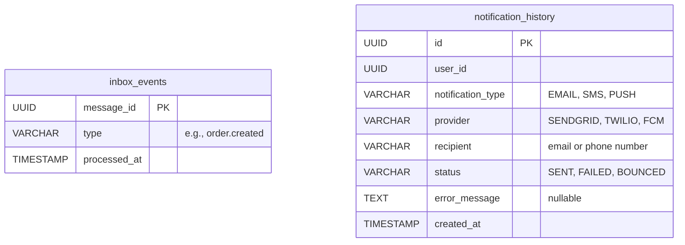

# SS-NotificationService

SS-NotificationService is an enterprise-grade microservice for the SamStore e-commerce platform responsible for processing and dispatching user notifications across multiple channels (Email, SMS, Push). 

Built with **Golang**, this service implements **Clean Architecture** and acts as an asynchronous consumer of domain events via **RabbitMQ**, ensuring reliable delivery and idempotency.

## 🚀 Features
- **Event-Driven**: Consumes events from `samstore.events` (e.g., `order.created`, `payment.success`).
- **Idempotent Delivery**: Implements the **Inbox Pattern** using PostgreSQL to prevent duplicate notifications from broker redeliveries.
- **Multi-Channel Dispatching**: Supports routing to Email, SMS, and Push providers via the Strategy pattern.
- **Retry & DLQ Support**: Handles transient provider failures with exponential backoff and routes poison messages to Dead Letter Queues.
- **Observability**: Fully instrumented with OpenTelemetry and structured logging (`slog`).

## 🏗️ Architecture

This project follows Clean Architecture principles:
- **Domain**: Core entities (`Notification`, `InboxEvent`).
- **Usecase**: Business rules (idempotency, dispatch logic).
- **Infrastructure**: External adapters (PostgreSQL, SendGrid, Twilio).
- **Delivery**: RabbitMQ consumers.

### Entity Relationship Diagram (ERD)

The database schema is minimal but critical for ensuring data integrity and idempotency.

## 🛠️ Tech Stack
- **Language**: Go 1.22+
- **Database**: PostgreSQL (`sqlc` / `GORM`)
- **Message Broker**: RabbitMQ (`amqp091-go`)
- **Observability**: OpenTelemetry
- **Configuration**: Viper

## ⚙️ Setup & Development
1. Clone the repository.
2. Setup environment variables (refer to `.env.example`).
3. Run `docker-compose up -d` to start PostgreSQL and RabbitMQ.
4. Run migrations.
5. Execute `go run cmd/server/main.go`.
