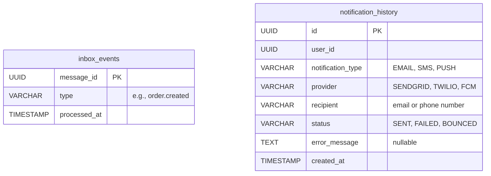

### 🗄️ Database Schema ERD (Idempotency & History)

```mermaid
erDiagram
    inbox_events {
        UUID message_id PK
        VARCHAR type "e.g., order.created"
        TIMESTAMP processed_at
    }

    notification_history {
        UUID id PK
        UUID user_id
        VARCHAR notification_type "EMAIL, SMS, PUSH"
        VARCHAR provider "SENDGRID, TWILIO, FCM"
        VARCHAR recipient "email or phone number"
        VARCHAR status "SENT, FAILED, BOUNCED"
        TEXT error_message "nullable"
        TIMESTAMP created_at
    }
```
